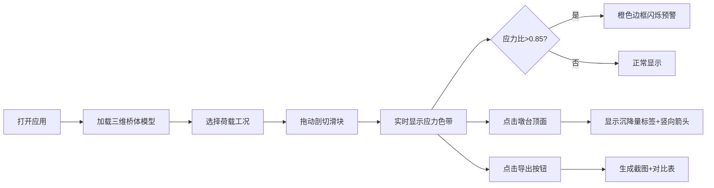
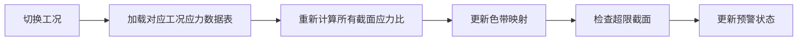

## 1. 产品概述

石拱桥拱圈应力剖切色带三维沙盒，为文物保护中心提供古桥修缮研判工具。通过三维可视化展示单孔石拱桥在不同荷载工况下的拱圈应力分布，支持沿桥轴方向的动态剖切、应力色带映射、墩台沉降监测及数据导出。

- 目标用户：文保中心工程师、古建筑修缮专家
- 核心价值：直观呈现拱圈结构受力状态，辅助古桥安全性评估与修缮方案制定

## 2. 核心特性

### 2.1 用户角色

| 角色 | 注册方式 | 核心权限 |
|------|----------|----------|
| 文保工程师 | 无需注册，本地使用 | 完整操作三维场景、切换工况、剖切分析、导出数据 |

### 2.2 功能模块

1. **三维场景主页面**：单孔石拱桥模型展示、交互控制、工况选择、剖切控制
2. **应力分析模块**：剖切截面应力色带渲染、超限预警闪烁
3. **沉降监测模块**：墩台点击交互、沉降量标签、竖向箭头可视化
4. **数据导出模块**：截面截图导出、三工况应力对比表生成

### 2.3 页面详情

| 页面名称 | 模块名称 | 功能描述 |
|---------|----------|----------|
| 主场景页 | 3D桥体渲染 | 单孔石拱桥（拱圈、墩台、桥面）三维模型，支持旋转、缩放、平移 |
| 主场景页 | 剖切控制 | 沿桥轴方向0-100%滑块拖动，实时显示拱圈剖切截面 |
| 主场景页 | 应力色带 | 蓝→黄→红连续色带映射截面应力，内置查表数值 |
| 主场景页 | 工况切换 | 三种工况（日常通行/庙会集中/应急戒严）切换，色带整体重算 |
| 主场景页 | 超限预警 | 截面最大应力比>0.85时，外轮廓闪烁橙色边框 |
| 主场景页 | 沉降监测 | 点击墩台顶面，弹出沉降量标签，显示竖向箭头 |
| 主场景页 | 数据导出 | 导出当前剖切位置截图 + 三工况最大应力比对比表 |

## 3. 核心流程

### 3.1 主操作流程

### 3.2 工况切换流程

## 4. 用户界面设计

### 4.1 设计风格

- **主题色调**：深灰底色（#1a1a2e）+ 石材质感本色，专业沉稳的工程分析氛围
- **主色调**：古铜色（#b8860b）- 呼应古建筑文物调性
- **色带颜色**：蓝色（#1e88e5）→ 黄色（#ffeb3b）→ 红色（#e53935）连续渐变
- **预警色**：橙色（#ff6d00）闪烁边框
- **字体**：标题使用 "Noto Serif SC"（宋体风格，呼应文保调性），正文使用 "JetBrains Mono"（等宽字体，工程数据清晰可读）
- **按钮风格**：微立体、圆角8px，悬停有轻微上浮效果
- **布局风格**：左侧控制面板 + 中央三维场景 + 右侧信息面板，三栏布局
- **视觉质感**：微妙的噪点纹理背景，半透明玻璃态面板，柔和阴影

### 4.2 页面设计概览

| 页面名称 | 模块名称 | UI元素 |
|---------|----------|--------|
| 主场景页 | 顶部标题栏 | 项目名称、工况选择下拉、导出按钮 |
| 主场景页 | 左侧控制面板 | 剖切滑块（带百分比显示）、色带图例、工况说明卡片 |
| 主场景页 | 中央3D场景 | 石拱桥模型、剖切平面、应力色带截面、沉降箭头 |
| 主场景页 | 右侧信息面板 | 当前工况信息、当前剖切位置、最大应力比、超限状态 |
| 主场景页 | 沉降标签 | 点击墩台后弹出的浮动标签，显示沉降量数值 |

### 4.3 响应式

- Desktop-first 设计，针对1920×1080及以上分辨率优化
- 最小支持宽度：1280px
- 三维场景自适应容器大小
- 控制面板在小屏幕下可折叠

### 4.4 3D场景指引

- **环境**：柔和的HDR环境光，模拟阴天自然光，突出石材纹理
- **光照设置**：主光源45°角照射，辅以环境光和补光，确保桥体各面可见
- **相机设置**：初始视角为桥体斜上方45°，支持轨道控制（OrbitControls）
- **交互**：左键旋转、右键平移、滚轮缩放
- **后处理**：轻微抗锯齿、环境光遮蔽（AO）增强立体感
- **动画**：剖切平面移动平滑过渡、应力色带渐变过渡、预警边框呼吸闪烁效果
- **性能**：模型面数控制在合理范围，确保60fps流畅运行
