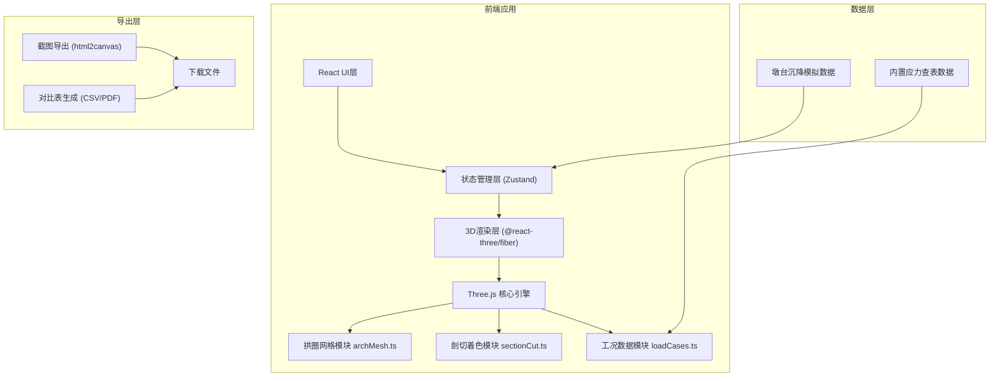

## 1. 架构设计



## 2. 技术描述

- **前端框架**：React@18 + TypeScript@5 + Vite@5
- **3D引擎**：three@0.160 + @react-three/fiber@8 + @react-three/drei@9
- **状态管理**：zustand@4
- **样式方案**：tailwindcss@3
- **图标库**：lucide-react
- **截图导出**：html2canvas
- **后端**：无（纯前端静态应用）
- **数据持久化**：内置JSON查表数据，无需数据库

## 3. 目录结构

```
src/
├── components/           # React UI组件
│   ├── ControlPanel/     # 左侧控制面板
│   ├── InfoPanel/        # 右侧信息面板
│   ├── Header/           # 顶部标题栏
│   ├── SectionSlider/    # 剖切滑块
│   ├── LoadCaseSelector/ # 工况选择器
│   ├── ColorLegend/      # 色带图例
│   └── SettlementLabel/  # 沉降标签
├── core/                 # 3D核心模块（分文件要求）
│   ├── archMesh.ts       # 拱圈网格生成
│   ├── sectionCut.ts     # 剖切着色逻辑
│   └── loadCases.ts      # 工况数据与切换
├── store/                # Zustand状态管理
│   └── useBridgeStore.ts
├── types/                # TypeScript类型定义
│   └── index.ts
├── data/                 # 内置查表数据
│   ├── stressTables.json # 应力数据表
│   └── settlementData.json # 沉降数据
├── utils/                # 工具函数
│   ├── colorMapping.ts   # 色带映射
│   ├── exportUtils.ts    # 导出工具
│   └── geometryUtils.ts  # 几何计算
├── App.tsx               # 主应用组件
├── main.tsx              # 入口文件
└── index.css             # 全局样式
```

## 4. 核心模块说明

### 4.1 拱圈网格模块 (src/core/archMesh.ts)

**职责**：生成拱圈、墩台、桥面的三维几何网格

**核心函数**：
- `createArchGeometry(radius, span, thickness, segments)` - 创建拱圈几何体
- `createPierGeometry(width, height, depth)` - 创建墩台几何体
- `createDeckGeometry(length, width, thickness)` - 创建桥面几何体
- `generateArchVertices()` - 生成拱圈顶点坐标数组
- `createArchMesh()` - 组合创建完整桥体网格对象

### 4.2 剖切着色模块 (src/core/sectionCut.ts)

**职责**：处理剖切平面计算、截面应力着色、超限预警

**核心函数**：
- `calculateCutPlane(positionPercent)` - 根据百分比计算剖切平面
- `intersectArchWithPlane(archMesh, plane)` - 计算拱圈与平面的交线
- `mapStressToColor(stressRatio)` - 应力比到色带颜色映射
- `createSectionGeometry(intersectionPoints)` - 创建截面对象
- `checkOverLimit(stressRatio)` - 检查是否超过0.85阈值
- `updateSectionColors(loadCaseData)` - 更新截面着色

### 4.3 工况切换模块 (src/core/loadCases.ts)

**职责**：管理三种荷载工况数据、切换时重计算

**工况定义**：
- `CASE_DAILY` - 日常通行（车辆+行人混合）
- `CASE_FESTIVAL` - 庙会集中（密集人群）
- `CASE_EMERGENCY` - 应急戒严（仅步行）

**核心函数**：
- `getLoadCaseData(caseType)` - 获取工况应力数据
- `recalculateStressRatios(caseType)` - 重算所有截面应力比
- `getMaxStressRatioAtPosition(position, caseType)` - 获取指定位置最大应力比
- `compareAllCases(position)` - 对比三工况应力比

## 5. 状态管理 (Zustand)

```typescript
interface BridgeState {
  // 剖切控制
  cutPosition: number; // 0-100
  setCutPosition: (pos: number) => void;
  
  // 工况控制
  currentLoadCase: 'daily' | 'festival' | 'emergency';
  setLoadCase: (caseType: string) => void;
  
  // 应力数据
  stressRatios: number[];
  maxStressRatio: number;
  isOverLimit: boolean;
  
  // 沉降数据
  selectedPier: 'left' | 'right' | null;
  settlementValues: { left: number; right: number };
  selectPier: (pier: 'left' | 'right' | null) => void;
  
  // 3D场景
  showSection: boolean;
  showSettlementArrows: boolean;
  
  // 操作
  recalculateStress: () => void;
  exportData: () => void;
}
```

## 6. 数据模型

### 6.1 应力数据表结构

```json
{
  "daily": {
    "positions": [0, 10, 20, ..., 100],
    "stressRatios": [0.32, 0.45, 0.58, ..., 0.41],
    "maxStress": 2.8
  },
  "festival": { ... },
  "emergency": { ... }
}
```

### 6.2 沉降数据结构

```json
{
  "leftPier": {
    "settlementMm": 12.5,
    "direction": "down",
    "lastUpdated": "2026-01-15"
  },
  "rightPier": {
    "settlementMm": 8.3,
    "direction": "down",
    "lastUpdated": "2026-01-15"
  }
}
```

## 7. 关键技术实现

### 7.1 剖切算法
- 使用 Three.js `Plane` 对象定义剖切平面
- 使用 `THREE.Triangle` 与平面求交算法计算截面轮廓
- 截面网格使用 `BufferGeometry` 动态更新顶点颜色

### 7.2 色带映射
- 采用 HSL 颜色空间插值：蓝色(210°) → 黄色(60°) → 红色(0°)
- 应力比 0.0 → 1.0 映射到色带
- 使用 `THREE.Color` 进行颜色计算

### 7.3 预警闪烁
- 使用 `useFrame` 钩子实现动画循环
- 正弦函数控制透明度/线宽脉动效果
- 频率：2Hz（每秒2次）

### 7.4 导出功能
- 截图：使用 html2canvas 捕获三维容器
- 对比表：生成 CSV 格式，包含三工况各11个点位（0%,10%,...,100%）
- 文件命名：`section_切位百分比_时间戳.png/csv`

## 8. Docker部署

```dockerfile
# 构建阶段
FROM node:18-alpine AS builder
WORKDIR /app
COPY package*.json ./
RUN npm ci
COPY . .
RUN npm run build

# 托管阶段
FROM nginx:alpine
COPY --from=builder /app/dist /usr/share/nginx/html
COPY nginx.conf /etc/nginx/conf.d/default.conf
EXPOSE 80
CMD ["nginx", "-g", "daemon off;"]
```

## 9. 性能优化

- 拱圈网格分段数：轴向50段，径向8段，平衡精度与性能
- 截面几何使用 `BufferGeometry` 而非 `Geometry`
- 应力数据预计算，切换工况时仅更新颜色缓冲
- 剖切滑块使用节流（throttle 16ms）避免过度重绘
- 使用 `InstancedMesh` 渲染重复元素（如拱石）
